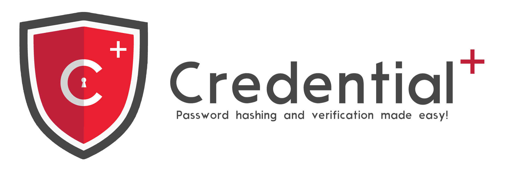

<h1 align="center">
  <a href="https://github.com/simonepri/credential-plus"></a>
</h1>
<div align="center">
  <a href="https://github.com/sindresorhus/awesome-nodejs"></a>
  <a href="https://travis-ci.org/simonepri/credential-plus"> </a>
  <a href="https://codecov.io/gh/simonepri/credential-plus"></a>
  <a href="https://github.com/sindresorhus/xo"></a>
  <a href="https://www.npmjs.com/package/credential-plus"></a>
  <a href="https://www.npmjs.com/package/credential-plus"></a>
  <a href="https://david-dm.org/simonepri/credential-plus"></a>
  <a href="https://david-dm.org/simonepri/credential-plus#info=devDependencies"></a>
  <a href="LICENSE"></a>
</div>
<br />
<div align="center">
  🛡 Easy password hashing and verification in Node.
</div>
<div align="center">
  <sub>
    Protects against brute force, rainbow tables, and timing attacks.
  </sub>
</div>

## Background

Over the past several years, we've seen major breaches exposing numerous
usernames and passwords. With every password breach comes the inevitable
question: Were the passwords stored securely?

This package aim to provide secure, well configured and ready to use password
hashing algorithms for your application.

## Install

```bash
$ npm install --save credential-plus
```

## Hash functions
This package is build with modularity in mind and supports multiple hash functions.
In order to use this package you need to pick at least one of them from this list:

Hash function name | Package to install
-------------------|-------------------
pbkdf2 | [credential-plus-pbkdf2](https://github.com/simonepri/credential-plus-pbkdf2)
bcrypt | [credential-plus-bcrypt](https://github.com/simonepri/credential-plus-bcrypt)
scrypt | [credential-plus-scrypt](https://github.com/simonepri/credential-plus-scrypt)
argon2 | [credential-plus-argon2](https://github.com/simonepri/credential-plus-argon2)

Currently the most vetted hashing algorithm providing most security is BCrypt.
PBKDF2 isn't bad either, but if you can use BCrypt you should.

In the next section we will use `pbkdf2` for examples, replace it with your choice if differs.

```bash
$ npm install --save credential-plus-pbkdf2
```

## Usage
```js
const credential = require('credential-plus');

// Installs the plugin.
credential.install(require('credential-plus-pbkdf2'));

// Hash and verify with default configs.
credential.hash('We are all humans', {func: 'pbkdf2'})
  .then(hash) => {

    console.log(hash);
    //=> '{"hash":"generated hash", "func":"pbkdf2"}'

    credential.verify(hash, 'We are all humans')
      .then(match) => {
        console.log(match);
        //=> true
      });

    credential.verify(hash, 'We are all unicorns')
      .then(match) => {
        console.log(match);
        //=> false
      });

  });
```

You can find more detailed usage examples in the ***usage*** section of each plugin:

* [pbkdf2](https://github.com/simonepri/credential-plus-pbkdf2#usage)
* [bcrypt](https://github.com/simonepri/credential-plus-bcrypt#usage)
* [scrypt](https://github.com/simonepri/credential-plus-scrypt#usage)
* [argon2](https://github.com/simonepri/credential-plus-argon2#usage)

## Migration
If your not building a new application, possibilities that you have already
implemented some hash/verify logic for your passwords are high.
This [wiki](https://github.com/simonepri/credential-plus/wiki/Migration) page aim to help you migrating to this package.

## API TOC

<dl>
<dt><a href="#hash">hash(password, options)</a> ⇒ <code>Promise.&lt;string&gt;</code></dt>
<dd><p>Creates a new &#39;unique&#39; hash from a password.</p>
</dd>
<dt><a href="#verify">verify(hash, input)</a> ⇒ <code>Promise.&lt;boolean&gt;</code></dt>
<dd><p>Determines whether or not the user&#39;s input matches the stored password.</p>
</dd>
<dt><a href="#installf">install(hashFunction)</a></dt>
<dd><p>Installs an hash function hashFunction.</p>
</dd>
<dt><a href="#list">list()</a> ⇒ <code>array</code></dt>
<dd></dd>
</dl>

## API

<a name="hash"></a>

## hash(password, options) ⇒ <code>Promise.&lt;string&gt;</code>
Creates a new 'unique' hash from a password.

**Kind**: global function  
**Returns**: <code>Promise.&lt;string&gt;</code> - A promise that contains a stringified object
 that holds the generated hash string, the name of the function used to hash
 it.  
**Access**: public

| Param | Type | Description |
| --- | --- | --- |
| password | <code>string</code> | The password to hash. |
| options | <code>object</code> | Options to configure the hash function. |
| options.func | <code>string</code> | The name of the hash function to use. |

Options available are different for each hash function.<br>
See the ***API*** section of the plugin you choose for more details:

* [pbkdf2](https://github.com/simonepri/credential-plus-pbkdf2#options)
* [bcrypt](https://github.com/simonepri/credential-plus-bcrypt#options)
* [scrypt](https://github.com/simonepri/credential-plus-scrypt#options)
* [argon2](https://github.com/simonepri/credential-plus-argon2#options)

<a name="verify"></a>

## verify(hash, input) ⇒ <code>Promise.&lt;boolean&gt;</code>
Determines whether or not the user's input matches the stored password.

**Kind**: global function  
**Returns**: <code>Promise.&lt;boolean&gt;</code> - A promise that contains a boolean that is true if
  if the hash computed for the input matches.  
**Access**: public

| Param | Type | Description |
| --- | --- | --- |
| hash | <code>string</code> | Stringified hash object generated from this package. |
| input | <code>string</code> | User's password input. |

<a name="installf"></a>

## install(hashFunction)
Installs an hash function hashFunction.

**Kind**: global function  
**Access**: public

| Param | Type | Description |
| --- | --- | --- |
| hashFunction | <code>object</code> | An hash function compatible with this package. |

<a name="list"></a>

## list() ⇒ <code>array</code>
**Kind**: global function  
**Returns**: <code>array</code> - The array of the available hash functions.  
**Access**: public

## Authors
* **Simone Primarosa** - [simonepri](https://github.com/simonepri)

See also the list of [contributors](https://github.com/simonepri/credential-plus/contributors) who participated in this project.

## License
This project is licensed under the MIT License - see the [LICENSE](LICENSE) file for details.
